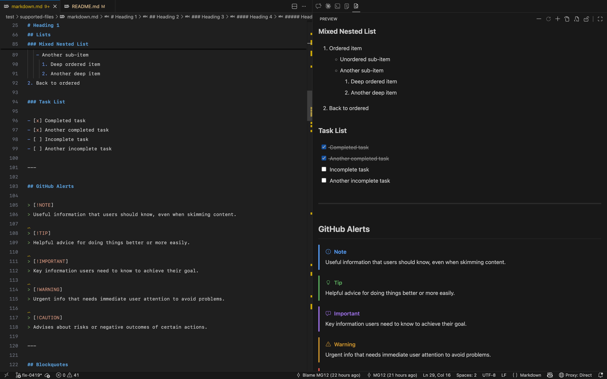
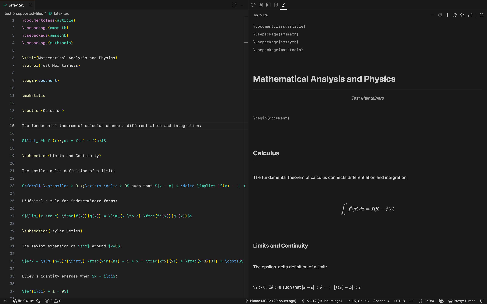
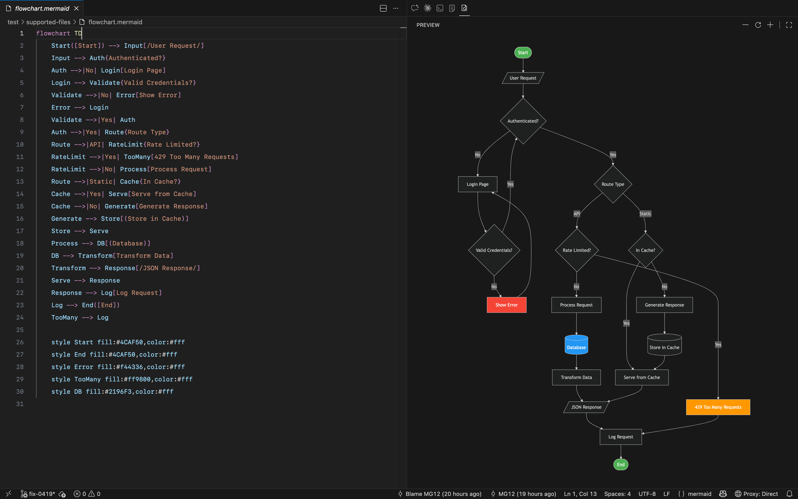
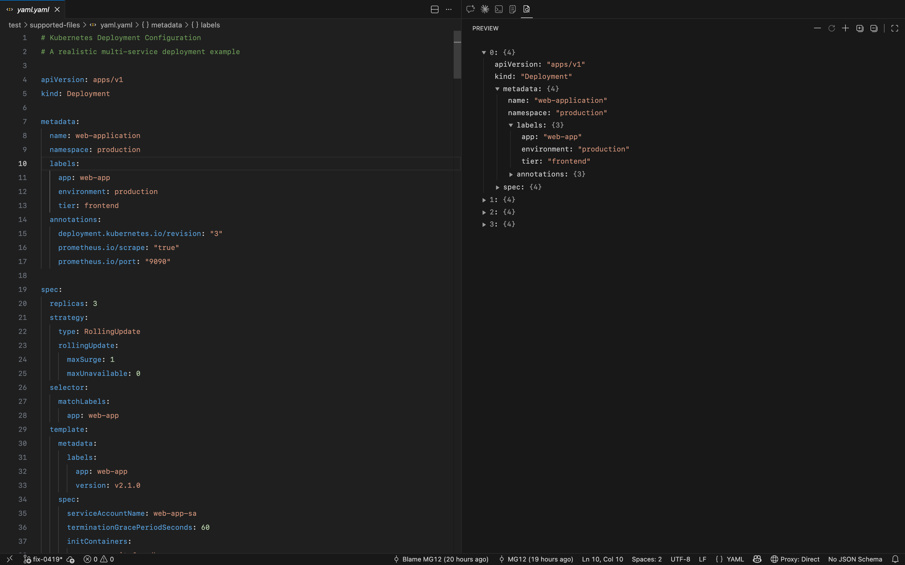

# Sidebar Previewer

VS Code 的侧边栏预览器，支持实时渲染、滚动同步、树形视图、缩放控制等功能，多文件格式支持包括 Markdown、LaTeX、Mermaid、JSON、YAML 和 TOML。

## 为什么需要它？

当 AI 改变了我们写代码的方式，文档也进化到了 **本地处理 + 源码共生** 的新阶段。现在的编辑器里，第二侧边栏才是 AI 时代的主战场。与其在标签页间局促跳转，不如让 **Sidebar Previewer** 为你化繁为简：文档在侧边栏实时呈现，代码与预览并肩而行。无论是埋头构建还是全屏演示，你的工作流从此告别割裂，尽享无缝切换。

## 支持的文件类型

| 文件类型 | 扩展名 |
| ------- | ------ |
| Markdown | `.md`、`.markdown` |
| LaTeX | `.tex` |
| Mermaid | `.mmd`、`.mermaid` |
| JSON | `.json` |
| YAML | `.yaml`、`.yml` |
| TOML | `.toml` |

## 功能介绍

### Markdown

- Front Matter 属性表格
- GitHub Alert 提示块渲染
- 任务列表勾选回写
- 代码高亮与复制按钮
- KaTeX 和 Mermaid 代码块渲染
- 编辑器与预览之间滚动同步、互相定位

### LaTeX

- 行内公式与常见数学环境的 KaTeX 渲染
- 编辑器与预览之间滚动同步、互相定位
- 支持缩放

### Mermaid

- `.mmd` 和 `.mermaid` 图表渲染
- 基础语法预检查与错误提示
- 放大后支持拖拽平移

### JSON / YAML / TOML

- 可折叠树形视图
- 全部展开 / 全部折叠
- 点击键名跳转源码行

## 安装方法

### 通过 VSIX 安装

1. 打开 VS Code
2. 按 `Cmd+Shift+P`（Mac）或 `Ctrl+Shift+P`（Windows/Linux）
3. 执行 `Extensions: Install from VSIX`
4. 选择提供的 `.vsix` 安装包

## 使用方法

1. 打开任意支持的文件（`.md`、`.markdown`、`.tex`、`.mmd`、`.mermaid`、`.json`、`.yaml`、`.yml`、`.toml`）
2. 点击左侧 Activity Bar 中的 Sidebar Previewer 图标
3. 预览面板会自动显示当前文件的渲染结果
4. 使用工具栏或 `Cmd/Ctrl` + 鼠标滚轮进行缩放
5. Mermaid 预览支持拖拽查看放大区域
6. JSON / YAML / TOML 可点击键名跳转到源码对应行

## 功能截图

| Type | Screenshot |
| ---- | ---------- |
| Markdown |  |
| LaTeX |  |
| Mermaid |  |
| JSON&nbsp;/&nbsp;YAML&nbsp;/&nbsp;TOML |  |

## 致谢

- [marked](https://github.com/markedjs/marked): parses Markdown into HTML for preview rendering.
- [mermaid](https://github.com/mermaid-js/mermaid): renders Mermaid diagram blocks in Markdown and `.mmd/.mermaid` files.
- [katex](https://github.com/KaTeX/KaTeX): renders math formulas for Markdown and LaTeX preview.
- [highlight.js](https://github.com/highlightjs/highlight.js): provides syntax highlighting for code blocks.
- [js-yaml](https://github.com/nodeca/js-yaml): parses YAML data for structured preview.
- [toml](https://github.com/BinaryMuse/toml-node): parses TOML data for structured preview.

## 许可证

MIT
