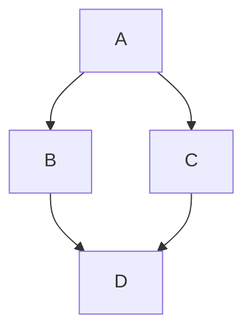

# Markdown Preview Test

> This file contains all standard Markdown formats for testing the preview sidebar.

---

## Headings

# Heading 1
## Heading 2
### Heading 3
#### Heading 4
##### Heading 5
###### Heading 6

---

## Text Formatting

This is a regular paragraph. Lorem ipsum dolor sit amet, consectetur adipiscing elit. Sed do eiusmod tempor incididunt ut labore et dolore magna aliqua.

**Bold text** and __also bold text__.

*Italic text* and _also italic text_.

***Bold and italic*** and ___also bold and italic___.

~~Strikethrough text~~

This is `inline code` in a sentence.

---

## Links

[GitHub](https://github.com)

[Link with title](https://github.com "GitHub Homepage")

Autolink: https://github.com

---

## Images


---

## Lists

### Unordered List

- Item 1
- Item 2
  - Nested item 2.1
  - Nested item 2.2
    - Deep nested item
- Item 3

### Ordered List

1. First item
2. Second item
   1. Nested item 2.1
   2. Nested item 2.2
3. Third item

### Mixed Nested List

1. Ordered item
   - Unordered sub-item
   - Another sub-item
     1. Deep ordered item
     2. Another deep item
2. Back to ordered

### Task List

- [x] Completed task
- [x] Another completed task
- [ ] Incomplete task
- [ ] Another incomplete task

---

## GitHub Alerts

> [!NOTE]
> Useful information that users should know, even when skimming content.

> [!TIP]
> Helpful advice for doing things better or more easily.

> [!IMPORTANT]
> Key information users need to know to achieve their goal.

> [!WARNING]
> Urgent info that needs immediate user attention to avoid problems.

> [!CAUTION]
> Advises about risks or negative outcomes of certain actions.

---

## Blockquotes

> This is a blockquote.

> Multi-line blockquote.
>
> Second paragraph in blockquote.

> Nested blockquotes:
>
> > This is a nested blockquote.
> >
> > > Even deeper nesting.

> **Blockquote** with *formatted* text and `inline code`.

---

## Code Blocks

### JavaScript

```javascript
function fibonacci(n) {
  if (n <= 1) return n;
  return fibonacci(n - 1) + fibonacci(n - 2);
}

const result = fibonacci(10);
console.log(`Fibonacci(10) = ${result}`);
```

### TypeScript

```typescript
interface User {
  id: number;
  name: string;
  email: string;
}

async function fetchUser(id: number): Promise<User> {
  const response = await fetch(`/api/users/${id}`);
  return response.json();
}
```

### Python

```python
class Calculator:
    def __init__(self):
        self.history = []

    def add(self, a: float, b: float) -> float:
        result = a + b
        self.history.append(f"{a} + {b} = {result}")
        return result

calc = Calculator()
print(calc.add(3, 5))
```

### HTML

```html
<!DOCTYPE html>
<html lang="en">
<head>
  <meta charset="UTF-8">
  <title>Hello World</title>
</head>
<body>
  <h1>Hello, World!</h1>
  <p>This is a paragraph.</p>
</body>
</html>
```

### CSS

```css
.container {
  display: flex;
  justify-content: center;
  align-items: center;
  min-height: 100vh;
  background: linear-gradient(135deg, #667eea 0%, #764ba2 100%);
}
```

### JSON

```json
{
  "name": "markdown-preview-sidebar",
  "author": "Test Maintainers",
  "description": "A generic Markdown fixture for preview testing",
  "keywords": ["markdown", "preview", "sidebar"]
}
```

### Shell

```bash
#!/bin/bash
echo "Hello, World!"
for i in {1..5}; do
  echo "Count: $i"
done
```

### Plain Code Block (no language)

```
This is a plain code block
without any syntax highlighting.
Line 3 of the code block.
```

---

## Diagrams and Math

### Mermaid Diagram (Preview Only)



### LaTeX Source (Code Block)

```latex
\documentclass{article}
\begin{document}
Hello World!
\end{document}
```

### Math Formula (Preview Only)

```math
E = mc^2
```

### Inline Math

This is an inline math formula $$a^2 + b^2 = c^2$$ inside a paragraph.

### Math Environment (LaTeX Block)

\begin{equation}
f(x) = \int_{-\infty}^{\infty} \hat{f}(\xi)\,e^{2 \pi i \xi x} \,d\xi
\end{equation}

---

## Tables

### Simple Table

| Name   | Age | Role       |
|--------|-----|------------|
| Alice  | 28  | Developer  |
| Bob    | 32  | Designer   |
| Carol  | 25  | Manager    |

### Aligned Table

| Left Aligned | Center Aligned | Right Aligned |
|:-------------|:--------------:|--------------:|
| Cell 1       | Cell 2         | Cell 3        |
| Cell 4       | Cell 5         | Cell 6        |
| Long content here | **Bold** | *Italic*  |

---

## Horizontal Rules

Three different horizontal rule styles:

---

***

___

---

## Line Breaks

This line has a line break  
right here (two trailing spaces).

This line also has a line break.
And this is the next line (GFM line break).

---

## Special Characters & Escaping

\*This is not italic\*

\# This is not a heading

Symbols: &amp; &lt; &gt; &copy; &mdash;

---

## Inline HTML

<details>
<summary>Click to expand</summary>

This is hidden content inside a `<details>` element.

- Item A
- Item B
- Item C

</details>

<kbd>Ctrl</kbd> + <kbd>C</kbd> to copy.

Text with <sup>superscript</sup> and <sub>subscript</sub>.

<mark>Highlighted text</mark>

---

## Long Content (Scroll Test)

### Section A

Lorem ipsum dolor sit amet, consectetur adipiscing elit. Vivamus lacinia odio vitae vestibulum vestibulum. Cras vehicula, mi at tristique sagittis, risus ipsum laoreet ligula, eget venenatis nulla justo a diam. Proin nec turpis at dolor dictum lacinia. Nullam sit amet nisi condimentum erat iaculis viverra. Etiam ac tortor nec nunc pretium fermentum.

### Section B

Sed ut perspiciatis unde omnis iste natus error sit voluptatem accusantium doloremque laudantium, totam rem aperiam, eaque ipsa quae ab illo inventore veritatis et quasi architecto beatae vitae dicta sunt explicabo. Nemo enim ipsam voluptatem quia voluptas sit aspernatur aut odit aut fugit, sed quia consequuntur magni dolores eos qui ratione voluptatem sequi nesciunt.

### Section C

At vero eos et accusamus et iusto odio dignissimos ducimus qui blanditiis praesentium voluptatum deleniti atque corrupti quos dolores et quas molestias excepturi sint occaecati cupiditate non provident, similique sunt in culpa qui officia deserunt mollitia animi, id est laborum et dolorum fuga.

### Section D

Ut enim ad minima veniam, quis nostrum exercitationem ullam corporis suscipit laboriosam, nisi ut aliquid ex ea commodi consequatur? Quis autem vel eum iure reprehenderit qui in ea voluptate velit esse quam nihil molestiae consequatur, vel illum qui dolorem eum fugiat quo voluptas nulla pariatur?

---

## End

This concludes the Markdown preview test file. All standard formats should render correctly in the sidebar preview. 🎉
